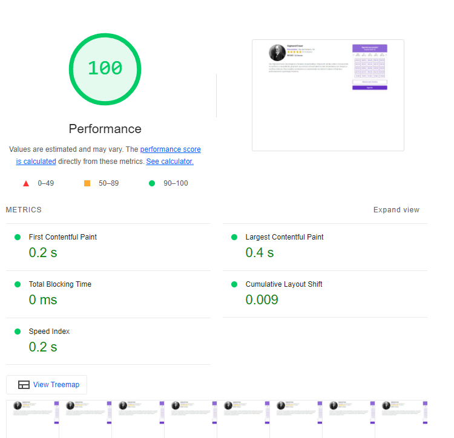

# Zenklub Frontend Test

Esse é um teste técnico para a empresa Zenklub. O objetivo foi replicar uma tela que contém um perfil profissional com algumas informações como foto, nome, descrição, avaliações e uma agenda/calendário contendo dias da semana e horários.

## Lógica da Aplicação e funcionalidades

A aplicação é composta por duas partes principais: o `UserBusinessProfile` e o `Calendar`.

#### Perfil Profissional:

O perfil profissional é renderizado pelo componente [`UserBusinessProfile`]. Este componente exibe informações como foto, nome, profissão, endereço, quantidade de estrelas, quantidade de avaliações, preço e duração em minutos.

#### Calendário/Agenda:

O calendário/agenda é gerenciado pelo componente [`Calendar`], que internamente utiliza o [`CalendarContent`] para renderizar o conteúdo do calendário. A lógica do calendário é implementada pelo hook [`useCalendar`] que processa os dados de calendário utilizando os dados [`currentDate`] [`daysOfWeek`] [`monthNames`] [`times`] para construi-lo:

- <b>Visualização Semanal:</b> Exibe os próximos dias da semana com base na data atual, utilizando o componente [`DayPicker`] para cada dia.
- <b>Intervalo de Tempo:</b> Cada [`DayPicker`] exibe os horários disponíveis para aquele dia específico.
- <b>Mostrar mais horários:</b> Um botão que exibe horários ocultos disponíveis, caso existam
- <b>Agendar:</b> Um botão que retorna o horário e dia selecionado.

O componente [`NavigationButton`] é utilizado para navegar entre os dias anteriores e posteriores na visualização semanal.

### Preview


## Montagem de Dados a partir de Requisições API

Este projeto utiliza requisições a um servidor local para buscar e montar dados para a renderização de componentes dentro da aplicação. Abaixo estão endpoints e como eles recuperam e usam dados dos serviços de backend.

#### getCalendarData

- **Endpoint**: `GET http://localhost:3333/calendar`
- **Função**: `getCalendarData`
- **Uso**:
  - `CalendarHeader` exibe a parte do cabeçalho do calendário usando os dados buscados.
  - `CalendarContent` exibe o conteúdo do calendário, como semanas e horários disponíveis.

#### getUserBusinessProfileData

- **Endpoint**: `GET http://localhost:3333/userBusinessProfile`
- **Função**: `getUserBusinessProfileData`
- **Uso**:
  - `UserBusinessProfileHeader` usa os dados para exibir a seção de cabeçalho do perfil de negócios do usuário.
  - `UserBusinessProfileDescription` exibe informações detalhadas sobre o negócio do usuário, como serviços oferecidos e sua descrição.

## Como executar o projeto

### Pré-requisitos

Antes de começar, você vai precisar ter instalado em sua máquina as seguintes ferramentas:
[Git](https://git-scm.com), [Node.js](https://nodejs.org/en/).
Além disto é bom ter um editor para trabalhar com o código como [VSCode](https://code.visualstudio.com/)

#### 🧭 Rodando a aplicação web (Frontend)

```bash

# Clone este repositório
$ git clone git@github.com:mateusbirtann/crypto-market-tracker.git

# Acesse a pasta do projeto no seu terminal/cmd
$ cd crypto-market-tracker

# Instale as dependências
$ pnpm install

# Execute a aplicação em modo de desenvolvimento
$ pnpm run dev

# Cria o bundle para publicação
$ pnpm run build

# Execute a aplicação em modo de produção
$ pnpm run start

# Executa o conjunto de testes disponível na aplicação
$ pnpm run test


# A aplicação será aberta na porta:3000/ em desenvolvimento e produção. Acesse http://localhost:3000/
```

#### 🧭 Rodando o servidor local (Backend)

```bash
# Navegue até a pasta do servidor dentro do projeto:
$ cd server

# Instale as dependências do projeto
$ pnpm install

# Inicie o servidor executando o seguinte comando:
$ pnpm install

# A aplicação será aberta na porta:3333
```

---

## 🛠 Estrutura de pastas

```
project/
├── app/
├── components/
├── hooks/
├── sections/
├── services/
├── types/
├── tests/
└── other_files/
```

- app/: A estrutura App Router é a versão mais recente que permite usar os novos recursos do Next/React, como server componentes e streaming.
- components/: Contém componentes reutilizáveis ​​que são usados ​​em várias partes do aplicativo
- hooks/: Contém hooks personalizados, que são funções reutilizáveis que encapsulam lógica comum (gerenciamento de estado, integração com APIs externas) para serem usadas em vários componentes do aplicativo.
- services/: Contém serviços fornecem funcionalidades específicas para o aplicativo. Isso pode incluir serviços de integração com APIs externas, serviços de armazenamento em cache, serviços de autenticação, etc.
- types/: Contém definições de tipos de dados personalizados usados ​​no aplicativo. Essas definições ajudam a garantir a consistência e a precisão dos dados manipulados pelo aplicativo, além de facilitar o desenvolvimento, fornecendo informações sobre a estrutura dos objetos de dados.
- tests/: Contém os testes automatizados para as diversas partes do aplicativo.
- lib/: Contém bibliotecas de código que são usadas em todo o aplicativo. Estas podem ser bibliotecas de terceiros ou bibliotecas personalizadas desenvolvidas especificamente para este projeto.

## 🛠 Tecnologias

As seguintes ferramentas foram usadas na construção do projeto, incluindo testes e setup.

#### **Website**

- **[Next.js](https://nextjs.org/)** - Framework React para renderização do lado do servidor e geração de sites estáticos.
- **[Tailwind](https://tailwindcss.com/)** - Estrutura CSS de baixo nível que permite estilo direto na marcação.
- **[Radix UI](https://www.radix-ui.com/)** - Biblioteca de componentes de código aberto otimizada para desenvolvimento rápido, fácil manutenção e acessibilidade.
- **[Eslint](https://eslint.org/)** - Ferramenta de linting que ajuda a detectar erros e problemas no código.
- **[Typescript](https://www.typescriptlang.org/)** - Superconjunto de JavaScript que adiciona tipagem estática e outros recursos.
- **[Jest](https://jestjs.io/pt-BR/)** - Framework de teste em JavaScript para testes unitários, integração e snapshot.
- **[Prettier](https://prettier.io/)** - Ferramenta de formatação de código que ajuda a manter um estilo consistente e legível.
- **[Lucide React](https://lucide.dev/)** - Conjunto de ícones leves e personalizáveis para projetos React.

## ⚡ Performance

Utilizando a ferramenta [Lighthouse](https://developers.google.com/web/tools/lighthouse), podemos avaliar e melhorar a qualidade da nossa aplicação web. O Lighthouse é uma ferramenta open-source automatizada que audita a performance, acessibilidade, práticas progressivas da web, SEO e mais.

Aqui estão os resultados do Lighthouse na última versão do projeto:

### Desktop


